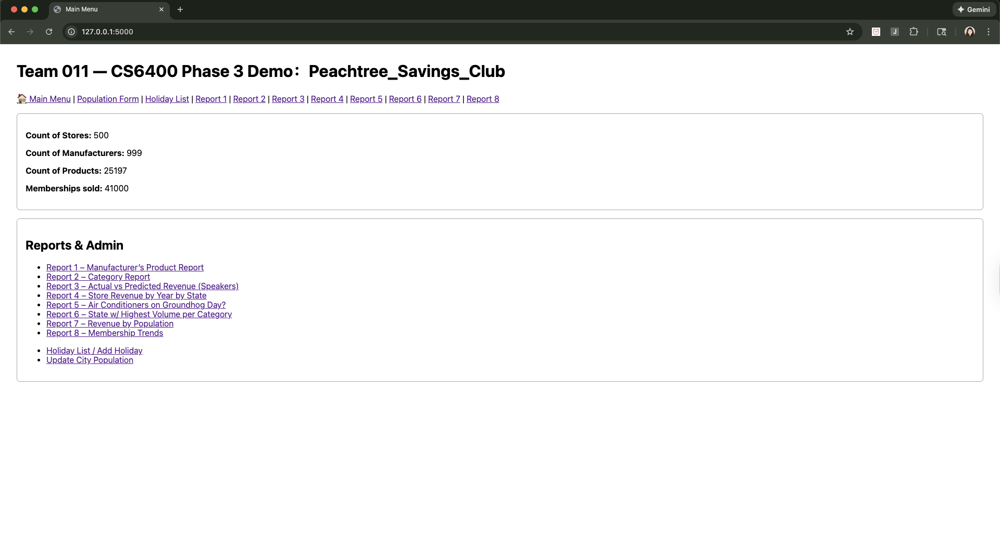
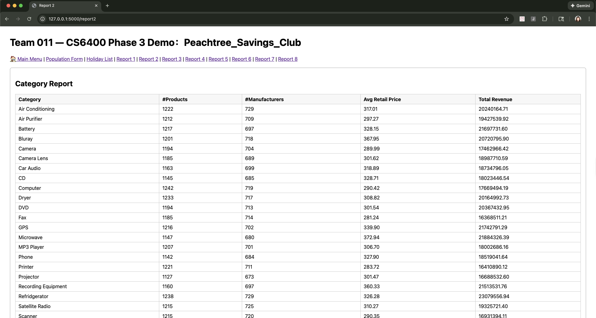
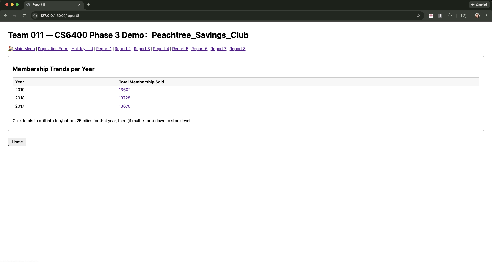

# Peachtree Savings Club – Database Analytics Demo

⚠️ **Note:**  
The source code for this project is private due to university course policy and team ownership.  
This repository contains a demo and architectural overview only.

---

## 🎥 Demo Video
A short walkthrough demonstrating the system functionality and database-backed reports.

▶️ **Watch the demo (~3 minutes):**  
[Demo Video Link](https://www.youtube.com/watch?v=K-tss6z30vo)

---

## 🧠 Project Overview
Peachtree Savings Club is a database-driven web application designed to support
analytical reporting and administrative operations for a retail membership system.

The project focuses on:
- Relational database design
- SQL-based analytics and aggregation
- Translating business rules into database queries

---

## 🗄️ System Architecture
- **Backend:** Flask (Python)
- **Database:** Relational database (MySQL)
- **Architecture Style:** Modular routes with centralized database access

Each analytical report is implemented as an independent backend module,
allowing query logic to remain isolated and maintainable.

Database connections and query execution are handled through a shared abstraction layer,
rather than being managed directly by individual routes.

---

## 📊 Key Features & Reports

### Dashboard Metrics
- Total stores, manufacturers, products, and memberships
- Metrics computed dynamically using SQL aggregation queries

### Administrative Operations
- Update city population data
- Maintain a holiday calendar used in downstream analysis

### Analytical Reports
- Manufacturer-level product statistics
- Category-based revenue analysis
- Actual vs. predicted revenue comparison using business rules
- Time-based sales analysis
- Revenue analysis by population size
- Membership trends with drill-down capability

All results displayed in the UI are generated directly from database queries.

---

## 📸 Screenshots

| Dashboard | Category Report |
|---------|-----------------|
|  |  |

| Revenue Analysis | Membership Trends |
|----------------|-------------------|
|  |  |

---

## 🔒 Why the Code Is Private
This project was developed as part of a team-based university database course.
To respect academic policy and collaboration agreements,
the source code is not publicly shared.

I am happy to discuss the database design, query logic, and architectural decisions
during interviews.

---

## 👤 Author
**Shu Wang**  
M.S. Computer Science – Georgia Tech  
